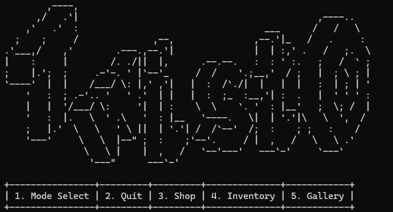
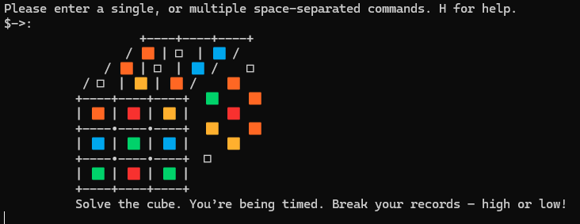
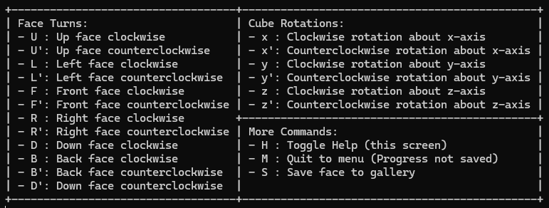

# TwistOCaml
A terminal based fully functional Rubik's Cube simulator built in OCaml. This was the final group project for CS3110, Data Structures and Functional Programming. It comes with 2x2 and 3x3 cubes, along with mini-games built around the 3x3. To run this please follow the instructions found [here](https://cs3110.github.io/textbook/chapters/preface/install.html).

## Built By
- Jack Ryan
- Michelle C.
- Kathereen Y.
- Siri R.